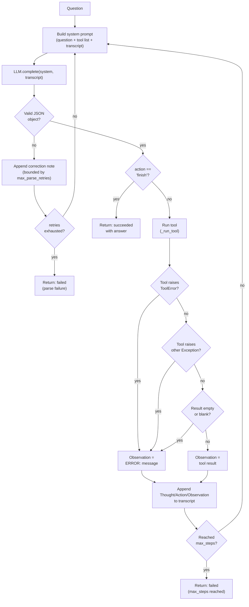

# Multi-Step Agent — Plans, Calls Tools, Recovers From Failure

A ReAct-style agent that plans in steps, calls real tools, tracks state across turns, and — the whole point — recovers when a tool fails instead of crashing.


> **AI Engineer Roadmap — Project 4.2**
> *Teaches: agentic control flow, tool use, state management, failure handling.*
> *Done when: your agent gracefully handles a tool returning garbage instead of crashing.*

## What it does

The agent runs a **plan → act → observe** loop: at each step the LLM sees the question, the available tools, and the running transcript, and replies with exactly one JSON object naming an action (a tool call, or `finish`). The agent executes the tool, appends the result as an observation, and repeats — up to `max_steps`.

It is provider-agnostic (Anthropic / OpenAI), and ships a deterministic **scripted LLM** so the entire agent loop and every failure path is testable offline with no API key and no network calls.

The project's actual subject is failure handling. Every failure mode is caught and turned into an **observation the agent can react to**, never an exception that ends the run:

| Failure | What the agent sees | Result |
| --- | --- | --- |
| Tool raises (`1/0`, transient 503) | `ERROR: <message>` | agent retries or switches tools |
| Tool returns garbage / empty | `ERROR: tool returned an empty result.` | agent retries |
| Unknown tool name | `ERROR: no such tool 'x'` | agent picks a valid tool |
| Tool crashes unexpectedly (non-`ToolError`) | `ERROR: tool 'x' crashed: ...` | contained, run continues |
| Malformed LLM JSON | a correction note | bounded re-prompts, then gives up cleanly |
| Runs too long | — | stops at `max_steps`, reports; never loops forever |

## Architecture



The `LLM` interface is a single method — `complete(system, transcript) -> str` — which is what makes the scripted/test LLM and real providers (`AnthropicLLM`, `OpenAILLM`) interchangeable. State (the transcript string and the structured `Step` trace) is carried across turns inside `Agent.run()` so the agent can build on earlier observations.

### Recovery in action (`python demo.py`)

The `exchange_rate` tool is configured to return an empty payload on its first call (simulating a flaky API). The agent doesn't crash — it sees the error, retries, and completes the task. Verified output from an actual run:

```
=== Agent trace ===
1. exchange_rate('EUR') -> ERROR: tool returned an empty result.
2. exchange_rate('EUR') -> 1 USD = 0.92 EUR
3. calculator('50 * 0.92') -> 46
4. FINISH -> 50 USD is about 46 EUR.

Succeeded: True | reason: finished
Answer: 50 USD is about 46 EUR.
```

## Quickstart

```bash
python -m venv .venv && source .venv/bin/activate   # Windows: .\.venv\Scripts\activate
pip install -e ".[dev]"          # core is stdlib-only; this adds pytest
python demo.py                   # watch the agent recover from a flaky tool
pytest -q                        # 15 tests, fully offline
```

To drive it with a real model instead of the scripted policy:

```bash
pip install -e ".[anthropic]"    # or ".[openai]"
```

```python
from agent import Agent, Calculator, Search, FlakyAPI, get_llm

agent = Agent(get_llm("anthropic", api_key="..."), [Calculator(), Search()])
result = agent.run("How many euros is 50 US dollars?")
```

## Project structure

```
src/agent/
├── __init__.py        # public exports: Agent, AgentResult, Step, LLM, tools
├── core.py             # the plan->act->observe loop + all failure handling
├── providers.py        # LLM interface, ScriptedLLM (offline), Anthropic/OpenAI
└── tools/
    ├── base.py         # Tool ABC + ToolError
    ├── calculator.py   # safe AST-walking arithmetic calculator (no eval)
    ├── search.py        # in-memory knowledge lookup
    └── flaky_api.py    # deterministically unreliable tool for testing recovery
demo.py                 # offline recovery demo (scripted LLM, no API key)
tests/test_agent.py     # 15 tests: tools in isolation, happy path, every failure path
pyproject.toml           # packaging + optional extras (anthropic, openai, dev)
```

## Key design decisions

- **The LLM is reduced to one method** (`complete(system, transcript) -> str`), which is what makes the scripted/test LLM and real providers interchangeable without touching `Agent`.
- **`ToolError` vs. unexpected exceptions are both handled, but reported distinctly** — a contract failure ("division by zero") reads differently from a genuine bug ("tool crashed"), which helps the agent *and* the developer debugging it.
- **Bounded everything**: parse retries (`max_parse_retries`) and total steps (`max_steps`) are capped, so a misbehaving model degrades to a clean failure result rather than an infinite loop or an unhandled exception.
- **No `eval`** — the calculator walks the Python AST and only permits numeric literals and arithmetic operators, so a malicious or malformed expression raises a clean `ToolError` instead of executing arbitrary code.

## Limitations

- Only tested end-to-end against the scripted LLM offline; the `AnthropicLLM`/`OpenAILLM` providers are thin, un-integration-tested wrappers over each SDK's `messages.create` call.
- The `search` tool is a small hardcoded in-memory fact table, not a real retrieval system — it exists to exercise the "empty result" failure path, not to answer general questions.
- The calculator supports only `+ - * / // % **` on numeric literals — no functions (`sqrt`, `sin`), variables, or multi-statement expressions.
- No conversation persistence — `Agent.run()` is a single in-memory call; nothing is saved to disk between runs.
- No CI configured — tests must currently be run locally (`pytest -q`).

## Roadmap

- GitHub Actions workflow to run the test suite on push/PR.
- An integration-test suite (marked to skip without an API key) that runs the same failure-recovery scenarios against a real Anthropic/OpenAI model.
- A retrieval-backed `search` tool (e.g. wrapping a real search API) behind the same `Tool` interface, so the failure-handling story extends past the toy fact base.
- Async LLM/tool support for use inside async applications.

## License

MIT — see [LICENSE](LICENSE).
